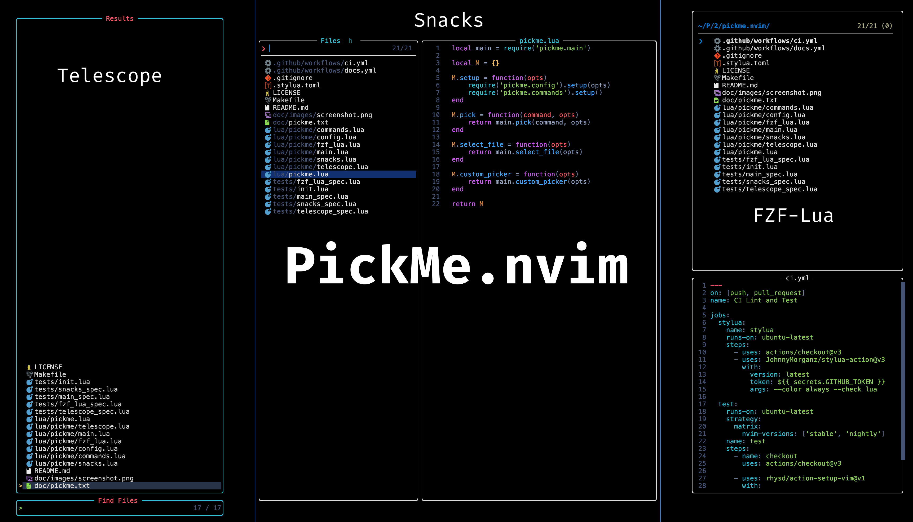

<div align = "center">

<h1><a href="https://github.com/2kabhishek/pickme.nvim">pickme.nvim</a></h1>

<a href="https://github.com/2KAbhishek/pickme.nvim/blob/main/LICENSE">
 </a>

<a href="https://github.com/2KAbhishek/pickme.nvim/graphs/contributors">
 </a>

<a href="https://github.com/2KAbhishek/pickme.nvim/stargazers">
</a>

<a href="https://github.com/2KAbhishek/pickme.nvim/network/members">
 </a>

<a href="https://github.com/2KAbhishek/pickme.nvim/watchers">
 </a>

<a href="https://github.com/2KAbhishek/pickme.nvim/pulse">
 </a>

<h3>Ready to go Neovim template 🏗️✈️</h3>

<figure>
  
  <br/>
  <figcaption>pickme.nvim in action</figcaption>
</figure>

</div>

# pickme.nvim

A unified interface for multiple Neovim picker plugins.

## ✨ Features

`pickme.nvim` provides a consistent API to work with different picker plugins in Neovim. It currently supports:

- [Snacks.picker](https://github.com/folke/snacks.nvim/blob/main/docs/picker.md)
- [Telescope](https://github.com/nvim-telescope/telescope.nvim)
- [fzf-lua](https://github.com/ibhagwan/fzf-lua)

## ⚡ Setup

### 💻 Installation

Using [lazy.nvim](https://github.com/folke/lazy.nvim):

```lua
{
  '2KAbhishek/pickme.nvim',
  cmd = 'PickMe',
  event = 'VeryLazy',
  dependencies = {
    -- Include at least one of these pickers:
    'folke/snacks.nvim', -- For snacks.picker
    -- 'nvim-telescope/telescope.nvim', -- For telescope
    -- 'ibhagwan/fzf-lua', -- For fzf-lua
  }
  opts = {
    picker_provider = 'snacks', -- Default provider
  },
}
```

## 🚀 Usage

### Configuration

```lua
require('pickme').setup({
  -- Choose your preferred picker provider
  picker_provider = 'snacks', -- Options: 'snacks' (default), 'telescope', 'fzf_lua'
})
```

## Available Pickers

All these pickers are available through a unified interface regardless of the underlying provider:

### Files and Navigation

- `files` - Find files in the current directory
- `git_files` - Find files tracked by Git
- `buffers` - Browse and select open buffers
- `oldfiles` - Browse recently opened files
- `live_grep` - Search for a string in your project (grep)
- `grep_string` - Search for the word under cursor
- `buffer_grep` - Search within the current buffer
- `tags` - Browse ctags

### Git Integration

- `git_branches` - View and checkout git branches
- `git_status` - View files with git status changes
- `git_commits` - Browse git commit history
- `git_stash` - Browse git stash entries

### LSP Features

- `lsp_references` - Find references to the symbol under cursor
- `lsp_document_symbols` - List symbols in current document
- `lsp_workspace_symbols` - Search through workspace symbols
- `lsp_definitions` - Go to definition of the symbol under cursor
- `lsp_implementations` - Find implementations of the interface under cursor
- `lsp_type_definitions` - Find type definitions
- `diagnostics` - View and navigate diagnostic messages

### Neovim Functionality

- `commands` - Browse available commands
- `help` - Search through help tags
- `marks` - View and jump to marks
- `registers` - View contents of registers
- `keymaps` - Browse configured key mappings
- `highlights` - Browse highlight groups
- `colorschemes` - Preview and apply colorschemes
- `man` - Browse man pages
- `jumplist` - Navigate through jump history
- `quickfix` - Browse quickfix list items
- `treesitter` - Navigate treesitter symbols

### History and Resume

- `command_history` - View command history
- `search_history` - View search history
- `spell_suggest` - Get spelling suggestions for word under cursor
- `resume` - Resume the last picker

### Custom Pickers

- `select_file` - Custom file picker with provided items
- `custom_picker` - Fully customizable picker with custom items and handlers

### Lua Usage

```lua
local pickme = require('pickme')

-- Basic usage
pickme.pick('files', { title = 'Find Files' })
pickme.pick('live_grep', { title = 'Search Text' })

-- Using custom picker
-- You can find example usage in https://github.com/2kabhishek/octohub.nvim/blob/main/lua/octohub/repos.lua
pickme.custom_picker({
  title = 'My Custom Picker',
  items = {'item1', 'item2', 'item3'},
  entry_maker = function(item)
    return { display = item, value = item }
  end,
  preview_generator = function(item)
    return "Preview content for " .. item
  end,
  preview_ft = 'markdown',
  selection_handler = function(_, selection)
    print("Selected: " .. selection.value)
  end
})
```

### Keybindings

Example key mappings:

```lua
local pickme = require('pickme')

vim.keymap.set('n', '<leader>ff', function() pickme.pick('files', { title = 'Find Files' }) end, { desc = 'Find Files' })
vim.keymap.set('n', '<leader>fg', function() pickme.pick('live_grep', { title = 'Search Text' }) end, { desc = 'Live Grep' })
vim.keymap.set('n', '<leader>fb', function() pickme.pick('buffers', { title = 'Buffers' }) end, { desc = 'Buffers' })
vim.keymap.set('n', '<leader>fh', function() pickme.pick('help', { title = 'Help Tags' }) end, { desc = 'Help Tags' })
vim.keymap.set('n', '<leader>fc', function() pickme.pick('commands', { title = 'Commands' }) end, { desc = 'Commands' })
vim.keymap.set('n', '<leader>fd', function() pickme.pick('diagnostics', { title = 'Diagnostics' }) end, { desc = 'Diagnostics' })
```

### Help

Run `:help pickme.txt` for more details.

## 🏗️ What's Next

- You tell me!

## ⛅ Behind The Code

### 🌈 Inspiration

I wanted an easy way to support different pickers in Neovim plugins, I wanted to create a unified interface for these pickers.

### 💡 Challenges/Learnings

- Finding information about different pickers supported by picker providers was time consuming.
- Got to create a unified interface for different pickers.

### 🧰 Tooling

- [dots2k](https://github.com/2kabhishek/dots2k) — Dev Environment
- [nvim2k](https://github.com/2kabhishek/nvim2k) — Personalized Editor
- [sway2k](https://github.com/2kabhishek/sway2k) — Desktop Environment
- [qute2k](https://github.com/2kabhishek/qute2k) — Personalized Browser

### 🔍 More Info

- [nerdy.nvim](https://github.com/2kabhishek/nerdy.nvim) — Find nerd glyphs easily
- [tdo.nvim](https://github.com/2KAbhishek/tdo.nvim) — Fast and simple notes in Neovim
- [termim.nvim](https://github.com/2kabhishek/termim.nvim) — Neovim terminal improved
- [octohub.nvim](https://github.com/2kabhishek/octohub.nvim) — Github repos in Neovim
- [exercism.nvim](https://github.com/2kabhishek/exercism.nvim) — Exercism exercises in Neovim

<hr>

<div align="center">

<strong>⭐ hit the star button if you found this useful ⭐</strong><br>

<a href="https://github.com/2KAbhishek/pickme.nvim">Source</a>
| <a href="https://2kabhishek.github.io/blog" target="_blank">Blog </a>
| <a href="https://twitter.com/2kabhishek" target="_blank">Twitter </a>
| <a href="https://linkedin.com/in/2kabhishek" target="_blank">LinkedIn </a>
| <a href="https://2kabhishek.github.io/links" target="_blank">More Links </a>
| <a href="https://2kabhishek.github.io/projects" target="_blank">Other Projects </a>

</div>
